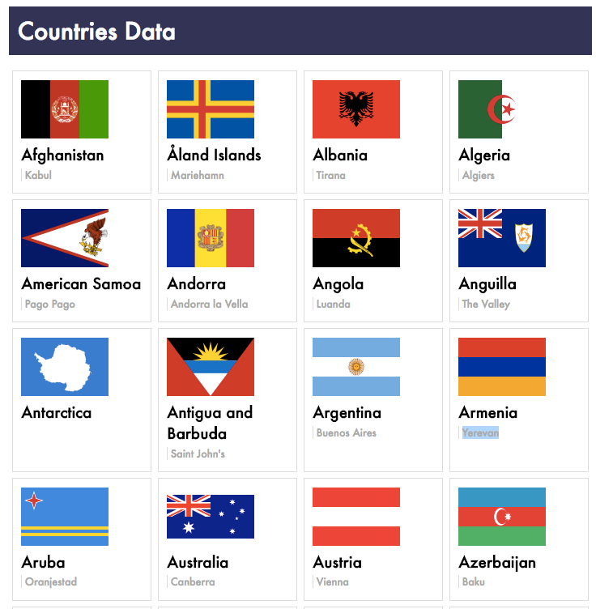

# Promises + APIs - Countries

## The Assignment

Use a promise library to request data from the [Rest Countries API](https://restcountries.eu/) and render an array of JSON data to the page. For each element, should render the flag, the


## Deliverables
- an application that uses the superagent promise library to fetch JSON data from the Rest Countries API
- JSON data rendered to the page as HTML
- a github repository named `rest-countries-api-assignment`


### Mockup



### Setup Instructions
1. Create the assignment folder in your `~/muktek/assignments` directory and cd into it.
```sh
mkdir ~/muktek/assignments/rest-countries-api-assignment
cd ~/muktek/assignments/rest-countries-api-assignment
```

2. Download assignment zip file in folder and unzip it.

3. In `index.html` use the `<script>` tag to link to the superagent library and link to your javascrpt file (`./js/app.js`). Make sure you link to the superagent library first!.

4. Make sure the superagent library is linked properly.
```js
console.log(superagent)
```

5. Store the superagent library into a variable called `request`
```js
const request = superagent
```

### Keys to success

1. Make sure you can access the JSON data in the browser from the Rest Countries API.

2. Request the data using the superagent promise library. Refer to the class demo if necessary.

3. Convert each object from in the JSON array into a giant string where each object has this html format:
```html
<div class="country-card">
  
  <h4 class="country-name">[[ Country ]]</h4>
  <p class="country-capital">[[ Capital ]]</p>
</div>
```

4. Put the string on the DOM inside the `<div class="countries-container">` element 
