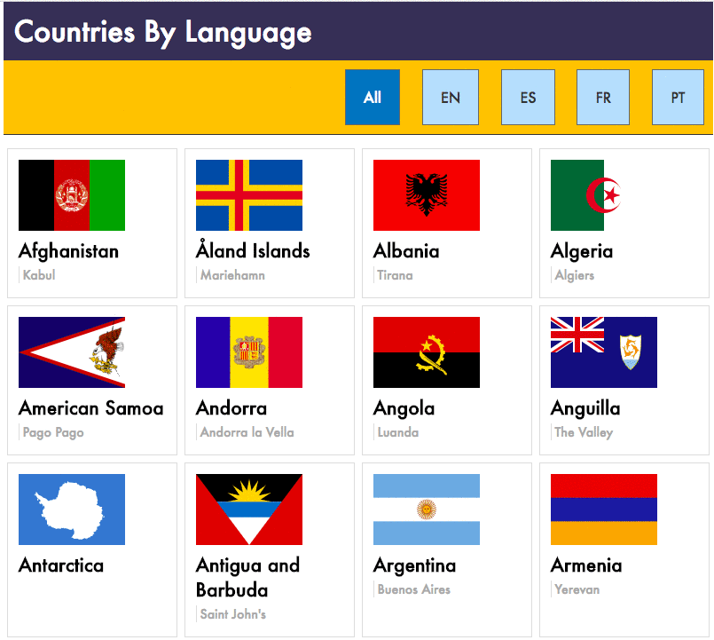

# Intro to Client Routing

## The Assignment

Use a promise library to request data from the [Rest Countries API](https://restcountries.eu/) and client side routing so that your application responds to changes in the url bar. Your routes should execute functions that request different url's from the API in order to render the correct set of data to the page when a user clicks on a one of the language buttons. The U.I. should also handle click events on the `<span class="nav-option">` by adding a `nav-option--selected` class to the `<span>` element that was clicked and removing the `nav-option--selected` from the previous `<span>`.


## Deliverables
- an application that is built using the [webpack-simple-server](https://github.com/muktek/build--webpack-simple-server) starter kit.
- an application that uses the superagent promise library to fetch JSON data from the Rest Countries API
- an application that uses the director routing library to execute functions based on the current value in the route
- JSON data rendered to the page as HTML
- a github repository named `rest-countries-client-routing`


### Mockup



### Setup Instructions

1. In terminal:
```sh
# Navigate to `~/muktek/assignments`
cd ~/muktek/assignments

# Clone the repo and cd into it
git clone git@github.com:muktek/build--webpack-simple-server.git client-side-routing-rest-countries
cd client-side-routing-rest-countries

# Clear the remote origin and create your own repo
git remote origin master
hub create

# Install default packages from package.json
npm install

# Add + Install packages necessary for project
npm install superagent director

# Run dev server and checkout http://localhost:3000
npm run dev

# Create production build (before pushing)
npm run build:production
```
